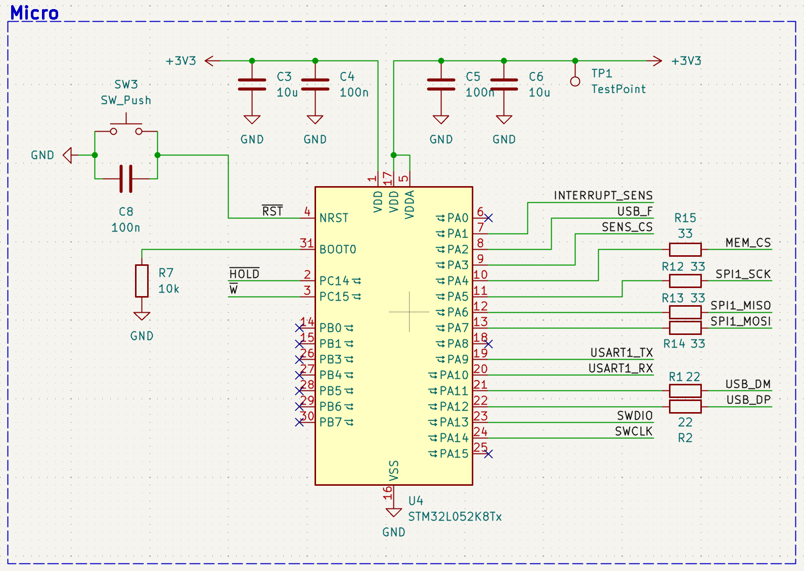
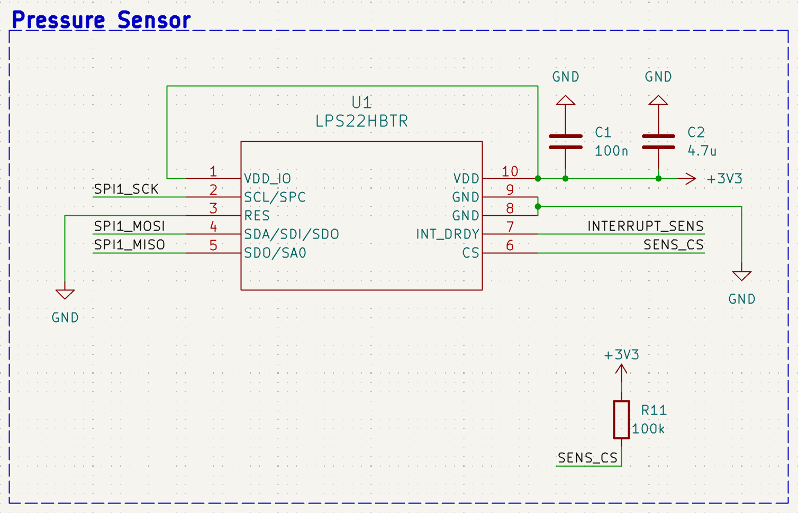
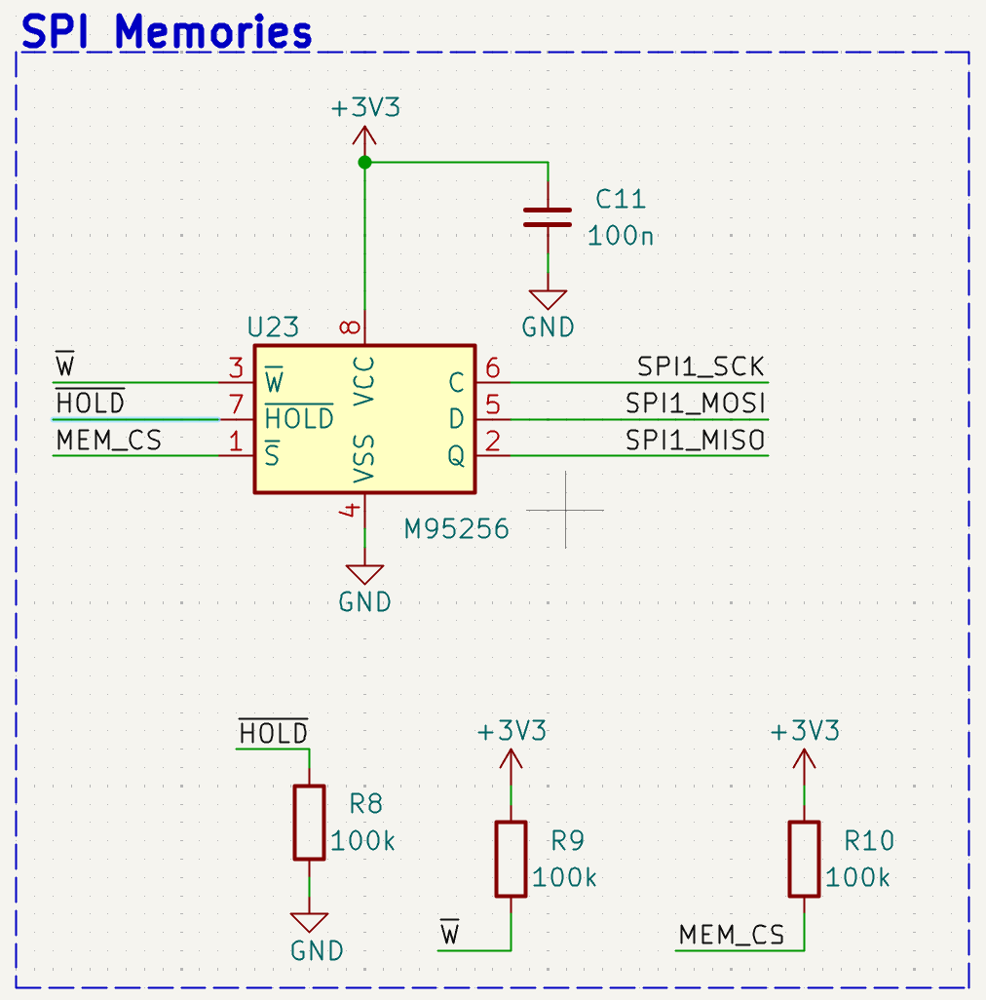
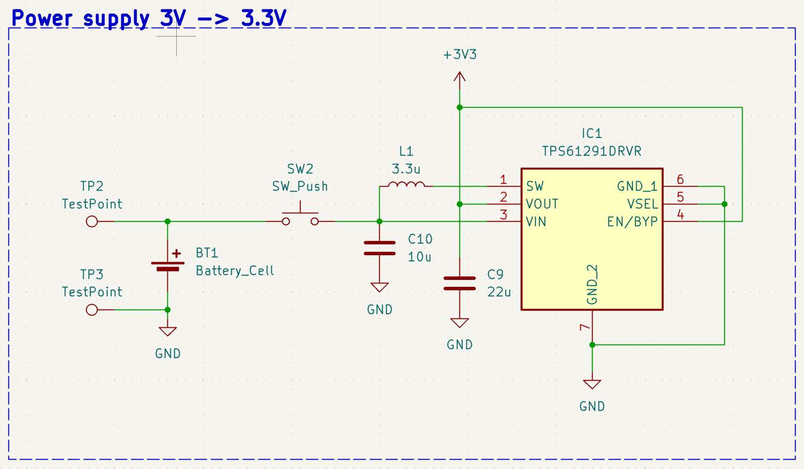
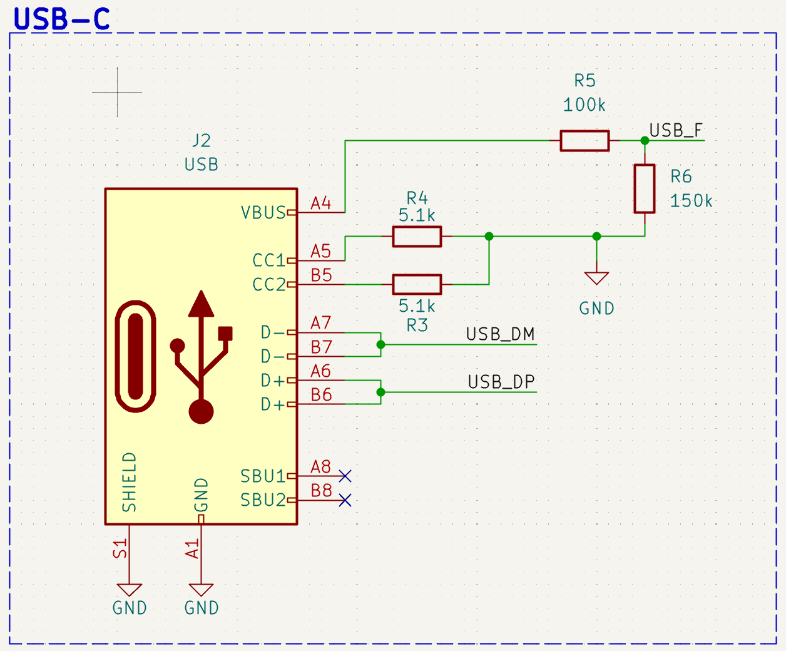
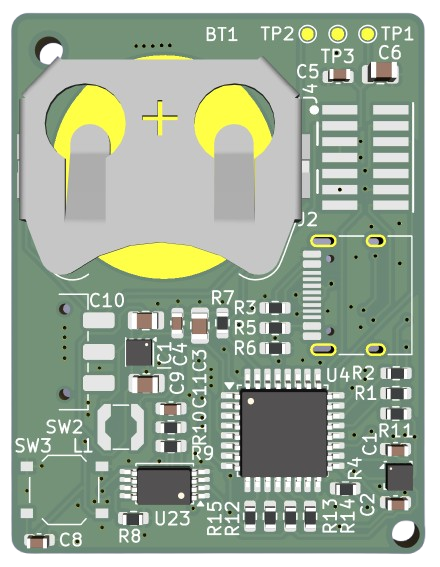
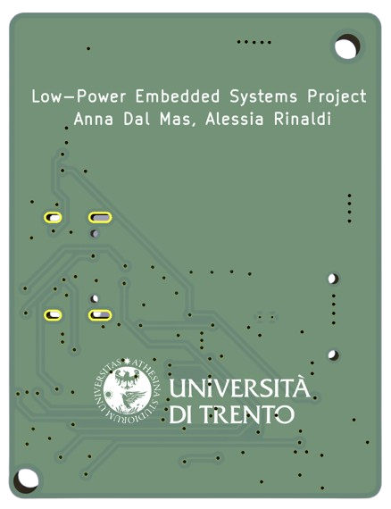

This section describes the hardware architecture of the Air Analyzer system.

The device is based on a compact embedded board designed to acquire breathing-related pressure variations inside a sports mask, store the acquired data locally, and allow data retrieval through USB-C.

---

# Hardware Architecture

The hardware system is composed of the following main blocks:

```text
CR2032 Battery
      ↓
Power Management Stage
      ↓
3.3 V Regulated Supply
      ↓
STM32L052 Microcontroller
      ↓
SPI Bus
 ┌───────────────┬───────────────┐
 ↓               ↓
LPS22HBTR        M95256 EEPROM
Pressure Sensor  Memory
      ↓
USB-C Interface for Data Retrieval
```

The system is designed to be compact, low-power, and suitable for integration into a wearable mask.

---

# Main Components

The electronic system is built around the following components.

| Component | Function |
|---|---|
| **STM32L052K8Tx** | Ultra-low-power ARM Cortex-M0+ microcontroller |
| **LPS22HBTR** | Barometric pressure sensor used to detect breathing-related pressure variations |
| **M95256** | 256 Kbit SPI EEPROM used for local data storage |
| **TPS61291** | Low-power boost converter used to generate a regulated 3.3 V supply |
| **CR2032 battery** | Coin cell battery used as the main power source |
| **USB-C connector** | Interface used for post-session data retrieval |

---

# Microcontroller

The system uses the **STM32L052K8Tx**, an ultra-low-power microcontroller based on the ARM Cortex-M0+ core.

This microcontroller was selected because it provides:

- low-power operating modes;
- STOP mode support;
- SPI communication peripherals;
- native USB Full Speed support;
- enough GPIO pins for sensor, memory, and control signals.

The microcontroller manages the complete acquisition and storage workflow. It configures the pressure sensor, handles interrupts, reads pressure samples through SPI, and writes the acquired data to the external EEPROM.

{fig-alt="STM32L052 microcontroller schematic" width=45%}

*STM32L052 microcontroller with the surrounding hardware required for correct operation.*

---

# Pressure Sensor

The selected pressure sensor is the **LPS22HBTR** from STMicroelectronics.

This sensor is used to measure the small pressure variations generated by breathing inside the mask. These pressure variations are then used to identify inhalation and exhalation cycles.

{fig-alt="LPS22HBTR pressure sensor schematic" width=45%}

*LPS22HBTR pressure sensor schematic section.*

Main characteristics:

| Parameter | Value |
|---|---|
| Sensor type | Barometric pressure sensor |
| Pressure range | 260–1260 hPa |
| Relative accuracy | ±0.1 hPa |
| Interface | SPI |
| SPI clock | up to 10 MHz |
| FIFO | 32 levels |

The internal FIFO is important for the low-power strategy. Instead of forcing the microcontroller to read every sample immediately, the sensor can accumulate samples and generate an interrupt when the FIFO reaches a threshold.

---

# External Memory

The system uses an **M95256 SPI EEPROM** for local data storage.

{fig-alt="M95256 SPI EEPROM schematic" width=45%}

*256 Kbit SPI EEPROM used for local pressure data storage.*

The memory size is:

```text
256 Kbit = 32 KB
```

Each pressure sample is stored using 3 bytes, corresponding to the 24-bit raw pressure output of the sensor.

At a sampling frequency of 8 Hz, the approximate recording duration is:

```text
32,768 bytes / (3 bytes/sample × 8 samples/s) ≈ 1,365 s ≈ 22 min
```

This local storage approach avoids continuous wireless transmission and allows the user to download the data only after the recording session.

---

# Power Supply

The system is powered by a **CR2032 coin cell battery**.

A **TPS61291 boost converter** is used to generate a regulated 3.3 V supply for the electronic components.

{fig-alt="Power supply schematic with boost converter" width=45%}

*Power supply schematic section used to provide the regulated 3.3 V rail.*

The power supply stage is designed with low-power operation in mind. The objective is to allow the system to operate from a small battery while minimizing current consumption during inactive periods.

---

# USB-C Interface

The USB-C connector is used for post-session communication with a PC.

The system does not continuously stream data during the acquisition phase. Instead, data are stored locally during the recording session and retrieved later through USB.

This design choice reduces power consumption and simplifies the use of the device during physical activity.

{fig-alt="USB-C Interface schematic" width=45%}

---

# PCB Design

A custom **50 × 50 mm two-layer PCB** was designed for the project.

The PCB integrates:

- microcontroller;
- pressure sensor;
- SPI EEPROM memory;
- power supply circuit;
- USB-C connector;
- battery connection;
- test points;
- mounting holes for mechanical integration.

{fig-alt="PCB front view" width=40%}
{fig-alt="PCB back view" width=40%}

*Front and back view of the custom Air Analyzer PCB.*

The compact form factor makes the board suitable for integration into the sports mask.

---

# PCB Design Choices

Some important PCB design choices include:

- **33 Ω series resistors** on SPI lines for signal integrity and EMI damping;
- **decoupling capacitors** placed close to each IC power supply pin;
- **ground copper pour** on both layers to reduce noise;
- **test points** on unused GPIO pins for firmware debugging;
- **M2 mounting holes** for mechanical integration with the mask.

---

# Sampling Strategy

The expected respiratory signal has a relatively low frequency. During intense physical activity, breathing frequency can increase significantly, but it remains well below the selected sampling frequency.

A sampling rate of 8 Hz was chosen because it provides enough margin to capture the breathing waveform while keeping memory usage and power consumption limited.

This sampling rate allows the system to capture not only the breathing frequency, but also the general shape of the pressure waveform.

---

# Hardware Summary

| Parameter | Value |
|---|---|
| Microcontroller | STM32L052K8Tx |
| Pressure sensor | LPS22HBTR |
| Memory | M95256 SPI EEPROM |
| Memory size | 256 Kbit / 32 KB |
| Power supply | CR2032 battery |
| Voltage rail | 3.3 V |
| PCB size | 50 × 50 mm |
| Data interface | USB-C |
| Sensor interface | SPI |
| Sampling frequency | 8 Hz |
| Estimated recording time | about 22 minutes |
