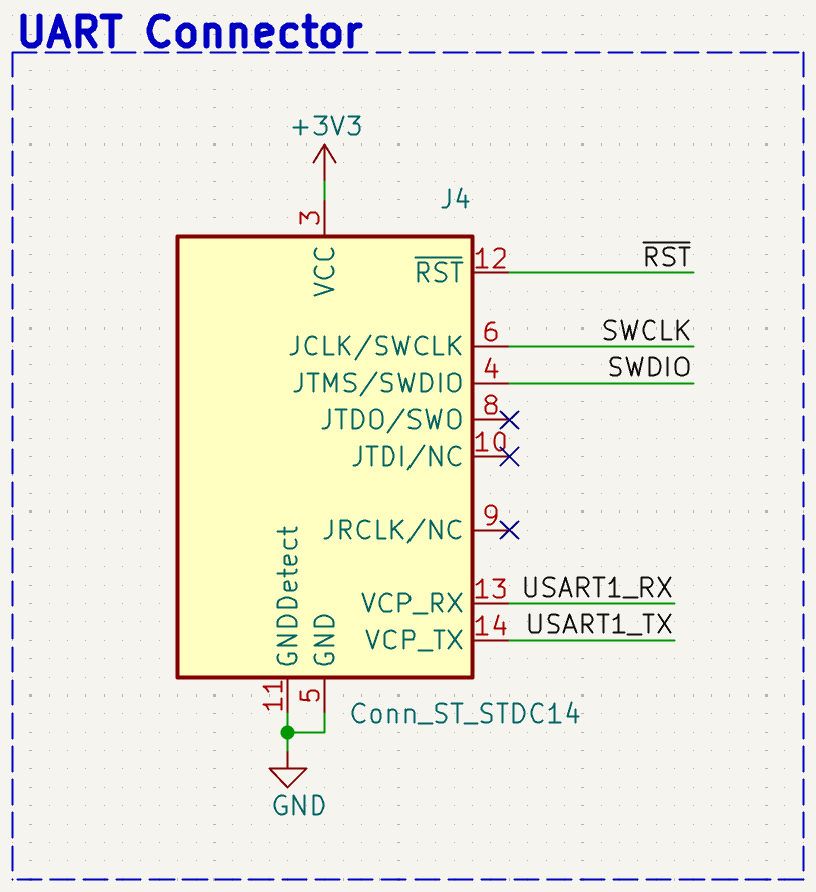

This section describes the hardware architecture of **Air Analyzer**, a low-power wearable system designed to acquire breathing-related pressure variations inside a sports mask, store the acquired data locally, and allow post-session data retrieval through a wired interface.

The main design goal is to avoid continuous wireless transmission during acquisition. Pressure samples are stored in a local non-volatile memory and downloaded only after the recording session. This reduces the average power consumption and makes the system suitable for operation from a compact coin cell battery.

---

# Hardware Architecture

The device is organized around a compact custom PCB that integrates power management, sensing, data storage, and communication interfaces.

```text
CR2032 Battery
      ↓
Power Management Stage
      ↓
3.3 V Regulated Supply
      ↓
STM32L052 Microcontroller
      ↓
SPI Bus
 ┌───────────────┬──────────────────┐
 ↓               ↓                  ↓
LPS22HBTR        M95256 EEPROM      USB-C / UART Interface
Pressure Sensor  Local Memory       for post-session data retrieval and debugging


```

The pressure sensor is placed inside the mask volume in order to capture the small pressure fluctuations generated by inhalation and exhalation. The microcontroller acquires the pressure signal, stores the raw samples in the external EEPROM, and later makes the recorded data available for offline analysis.

---

# Main Components

The electronic system is built around the following components.

| Component | Role in the system |
|---|---|
| **STM32L052K8Tx** | Ultra-low-power ARM Cortex-M0+ microcontroller used to control acquisition, storage, and communication |
| **LPS22HBTR** | Barometric pressure sensor used to detect breathing-related pressure variations inside the mask |
| **M95256** | 256 Kbit SPI EEPROM used for local non-volatile data storage |
| **TPS61291** | Low-power boost converter used to provide a regulated 3.3 V supply rail |
| **CR2032 battery** | Compact coin cell battery used as the main power source |
| **USB-C connector** | Wired interface used for post-session data download |
| **STDC14 / UART connector** | Debug, programming, and serial communication connector used during development |

---

# Microcontroller

The system uses the **STM32L052K8Tx**, an ultra-low-power microcontroller based on the ARM Cortex-M0+ core.

This device was selected because it provides low-power operating modes, SPI peripherals, DMA support, native USB Full Speed support, and enough GPIO pins to manage the pressure sensor, the external EEPROM, chip-select lines, and debugging interfaces.

In the Air Analyzer prototype, the microcontroller is responsible for:

- configuring the pressure sensor at startup;
- managing SPI communication with the pressure sensor and the EEPROM;
- using DMA-based transfers to reduce CPU activity during acquisition;
- storing pressure samples locally in the external memory;
- supporting post-session communication with a PC.

{fig-alt="STM32L052 microcontroller schematic" width=55%}

*STM32L052 microcontroller with the surrounding hardware required for correct operation.*

---

# Pressure Sensor

The selected pressure sensor is the **LPS22HBTR** from STMicroelectronics. It is used to measure the pressure variations generated by breathing inside the mask. These variations form the respiratory waveform from which inhalation and exhalation cycles can be extracted during offline analysis.

{fig-alt="LPS22HBTR pressure sensor schematic" width=55%}

*LPS22HBTR pressure sensor schematic section.*

Main characteristics used in the design are summarized below.

| Parameter | Value |
|---|---|
| Sensor type | Barometric pressure sensor |
| Pressure range | 260–1260 hPa |
| Relative accuracy | ±0.1 hPa |
| Pressure output | 24-bit raw value |
| Pressure sensitivity | 4096 LSB/hPa |
| Interface | SPI |
| SPI clock | up to 10 MHz |
| Selected sampling rate | 10 Hz |

Only the pressure output is acquired by the firmware. The sample is stored in raw 24-bit format, using 3 bytes per measurement. This avoids real-time floating-point conversion on the microcontroller and preserves the full sensor resolution for post-processing.

---

# External Memory

The system uses an **M95256 SPI EEPROM** for local data storage.

{fig-alt="M95256 SPI EEPROM schematic" width=50%}

*256 Kbit SPI EEPROM used for local pressure data storage.*

The memory size is:

```text
256 Kbit = 32 KB = 32768 bytes
```

Each pressure sample occupies 3 bytes, corresponding to the native 24-bit raw pressure output of the LPS22HBTR. At the selected sampling frequency of 10 Hz, the approximate recording duration is:

$$
T_{max} = \frac{32768\,\text{bytes}}{3\,\text{bytes/sample} \times 10\,\text{samples/s}}
\approx 1092\,\text{s}
\approx 18\,\text{min}
$$

This storage strategy avoids continuous wireless transmission during the acquisition phase. The device records data locally and transfers them to a PC only after the session has ended.

---

# Power Supply

The prototype is powered by a **CR2032 coin cell battery**. A **TPS61291** boost converter is used to provide a regulated 3.3 V rail to the electronic components.

{fig-alt="Power supply schematic with boost converter" width=55%}

*Power supply schematic section used to provide the regulated 3.3 V rail.*

The power supply architecture was selected to support a compact wearable form factor. Since the system stores data locally and does not require continuous radio communication, the power budget is mainly determined by the sensor, the microcontroller activity, the EEPROM write operations, and the efficiency of the power management stage.

---

# Wired Interfaces

## USB-C connector

The **USB-C connector** is used for post-session communication with a PC. During a recording session, the system does not stream data continuously. Instead, pressure samples are stored in the external EEPROM and retrieved later.

{fig-alt="USB-C interface schematic" width=50%}

*USB-C connector used for post-session data retrieval.*

## STDC14 and UART connector

The board also includes a debug and development interface based on the **STDC14 connector** and a dedicated UART connector. These interfaces simplify firmware development, programming, and serial debugging.

{fig-alt="UART connector schematic" width=45%}

*UART connector used for debugging and development communication.*

The STDC14 connector provides access to the SWD programming interface, reset line, supply reference, and serial communication lines. This allows the board to be programmed and tested without relying on the battery during development.

---

# PCB Design

A custom **50 × 50 mm two-layer PCB** was designed in KiCad. The board integrates the pressure sensor, microcontroller, EEPROM, power supply, wired communication connectors, test points, and mechanical mounting holes.

{fig-alt="PCB front view" width=42%}
{fig-alt="PCB back view" width=42%}

*Front and back view of the custom Air Analyzer PCB.*

The compact form factor makes the board suitable for integration with the 3D-printed mask structure.

---

# PCB Design Choices

Several design choices were adopted to improve reliability and simplify development:

- **33 Ω series resistors** on SPI lines to improve signal integrity and reduce ringing;
- **decoupling capacitors** placed close to the power pins of each integrated circuit;
- **ground copper pour** on both PCB layers to reduce noise and improve return paths;
- **test points** on unused GPIO pins to support debugging and future extensions;
- **M2 mounting holes** to simplify mechanical integration with the mask;
- **separate chip-select lines** for the pressure sensor and the EEPROM, allowing both devices to share the same SPI bus safely.

---

# Sampling Strategy

The respiratory signal has a relatively low frequency. During intense physical activity, breathing frequency can increase significantly, but it remains well below the selected acquisition frequency.

A sampling rate of **10 Hz** was chosen to provide margin above the minimum Nyquist requirement while still keeping memory usage and power consumption limited. This rate allows the system to capture not only the breathing frequency, but also the overall shape of the pressure waveform associated with each respiratory cycle.

Because each pressure sample is stored as a compact 3-byte raw value, the 32 KB EEPROM provides approximately **18 minutes** of recording time at 10 Hz.

---

# Mechanical Integration

The electronics are intended to be integrated with a 3D-printed mask structure. The prototype is based on the open-source [Universal Mask Concept with Seal](https://www.printables.com/model/30166-universal-mask-concept-with-seal) model.

The mask provides a rigid and reproducible support for the sensing system. Placing the pressure sensor inside the mask volume allows the device to capture breathing-induced pressure variations directly, without requiring chest belts or skin-contact sensors.

The PCB dimensions and mounting holes were selected to simplify mechanical integration with the mask while keeping the prototype compact and self-contained.

---

# Hardware Summary

| Parameter | Value |
|---|---|
| Microcontroller | STM32L052K8Tx |
| Pressure sensor | LPS22HBTR |
| Memory | M95256 SPI EEPROM |
| Memory size | 256 Kbit / 32 KB |
| Power source | CR2032 battery |
| Voltage rail | 3.3 V regulated |
| PCB size | 50 × 50 mm |
| Sensor interface | SPI |
| Data retrieval interface | USB-C / UART |
| Sampling frequency | 10 Hz |
| Sample size | 3 bytes |
| Estimated recording time | about 18 minutes |
